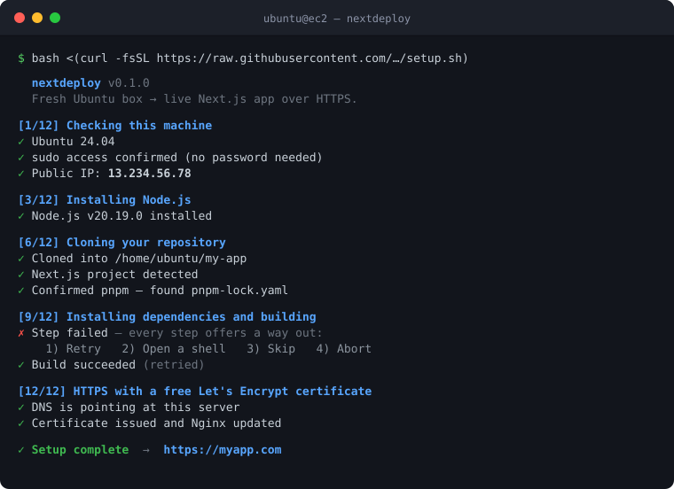

<p align="center">
  
</p>

<h1 align="center">nextdeploy</h1>

<p align="center">
  Take a fresh Ubuntu EC2 instance to a live Next.js app on HTTPS — with one command.
</p>

---

## Quick start

SSH into your server as `ubuntu` and run:

```bash
bash <(curl -fsSL https://raw.githubusercontent.com/rajjayavant/nextdeploy/main/setup.sh)
```

Answer the questions as they come. That's the whole thing.

> Use `bash <(curl ...)` as written — **not** `curl ... | bash`. The pipe form feeds the script's own text to the prompts, so they answer themselves.

## What it does

| Step | |
|---|---|
| 1 | Checks the machine — Ubuntu, sudo, disk, RAM. Adds swap on small instances. |
| 2 | `apt update` and base tools |
| 3 | Node.js 20 LTS |
| 4 | Asks which package manager you use |
| 5 | Asks for your repo, detects whether it's public or private |
| 6 | Private repos: generates an SSH key and shows you where to paste it |
| 7 | Clones, and works out which package manager the project *actually* needs |
| 8 | Asks for your `.env` (before the build — Next.js needs it then) |
| 9 | Installs dependencies and builds |
| 10 | Starts the app with PM2, enables start-on-reboot |
| 11 | Nginx reverse proxy on port 80 |
| 12 | Shows the DNS records to add, waits for them, then gets an HTTPS certificate |

Afterwards, `~/redeploy.sh` ships updates: pull → install → build → restart.

## Before you start

Open these ports on your instance's **security group** in the AWS console. The script runs *on* the server, so it can't do this for you:

| Type | Port | Source |
|---|---|---|
| SSH | 22 | Your IP |
| HTTP | 80 | `0.0.0.0/0` |
| HTTPS | 443 | `0.0.0.0/0` |

Port 80 must be open from anywhere, or Let's Encrypt can't verify your domain.

You'll also want a Next.js app in a Git repo, and a domain if you want HTTPS.

## If a step fails

You get a menu, not a stack trace:

```
✗ Step failed: Install and build

? What would you like to do?
    1) Retry this step
    2) Open a shell to investigate, then retry
    3) Skip this step (only if you know it's already done)
    4) Abort setup
```

Fix the problem, choose **Retry**, and it carries on. The script is safe to re-run from scratch too — it won't duplicate Nginx configs, stack PM2 processes, or re-clone over your app.

<details>
<summary><b>Do I need a sudo password?</b></summary>

<br>

No. Run it as `ubuntu` — *not* with `sudo`:

```bash
./setup.sh          # ✓
sudo ./setup.sh     # ✗ — the script refuses this
```

It calls `sudo` itself where needed. On a stock EC2 Ubuntu image the `ubuntu` user sudoes without a password, so you'll never be asked.

If you *are* asked, you're probably logged in as a user you created rather than `ubuntu`. Log in as `ubuntu` instead. If you meant to use your own user and it isn't in the sudo group, run `usermod -aG sudo YOUR_USERNAME` from a root shell, then log out and back in.

</details>

<details>
<summary><b>Troubleshooting</b></summary>

<br>

```bash
pm2 logs myapp                  # app logs — start here
pm2 status                      # is it running?
sudo nginx -t                   # is the Nginx config valid?
sudo systemctl status nginx     # is Nginx running?
sudo certbot certificates       # certificate status and expiry
curl -I http://127.0.0.1:3000   # does the app answer locally?
```

**Works on `http://<ip>` but not your domain** — DNS hasn't propagated. Give it a few minutes.

**Works via `curl` on the server but not in your browser** — the EC2 security group is blocking the port.

**Certbot fails with a timeout** — port 80 isn't reachable from outside. Same cause.

**Build gets killed partway through** — out of memory. Re-run and accept the swap file offer.

</details>

<details>
<summary><b>Why it does a few things the way it does</b></summary>

<br>

**Node 20 from NodeSource.** `apt install nodejs` on Ubuntu 22.04 gives you Node 12, which no current Next.js supports.

**Swap on instances under 2GB.** `next build` is memory-hungry and gets OOM-killed on a `t2.micro` with dispiriting reliability.

**`.env` before the build.** Next.js inlines `NEXT_PUBLIC_*` variables at build time. Writing the file afterwards leaves them `undefined` in the browser bundle.

**The package-manager question is a hint, not a commitment.** You're asked before the repo is on disk, so you'd be guessing. After cloning, the script reads `packageManager` and the lockfile and offers to switch if they disagree. npm, yarn, pnpm, and bun all work.

**The PM2 config is `.cjs`, never `.js`.** PM2 config is CommonJS, but a `package.json` with `"type": "module"` makes Node parse `.js` as an ES module, so `module.exports` throws. It's also loaded with `node` before PM2 sees it, because PM2's error for a bad config is just `malformated`.

**A PM2 ecosystem file** rather than `pm2 start "npm start"` — the latter makes PM2 look for a *file* by that name, and doesn't pass `PORT` to your app.

**The app runs as your user, not root.** Root-owned files and a root PM2 daemon cause permission problems later and widen the blast radius of any app vulnerability.

</details>

<details>
<summary><b>Project layout and tests</b></summary>

<br>

```
setup.sh          the installer
lib/ui.sh         prompts, colours, the retry engine
lib/validate.sh   input validation and pre-flight checks
tests/            run with: bash tests/run_all.sh
```

`setup.sh` fetches `lib/` automatically when piped from curl, so the one-liner works without cloning.

The tests cover what can be checked off-server: URL, domain, port and email validation; the retry engine; the prompt helpers; package-manager detection; and the generated Nginx, PM2, and redeploy configs. They don't cover apt, NodeSource, Certbot, or live DNS — those need a real Ubuntu host.

</details>

## Status

v0.1.0 — working, and deployed successfully end-to-end on Ubuntu 24.04. Still young, so expect rough edges on setups unlike that one. Issues and PRs welcome.

## License

MIT — see [LICENSE](LICENSE).
